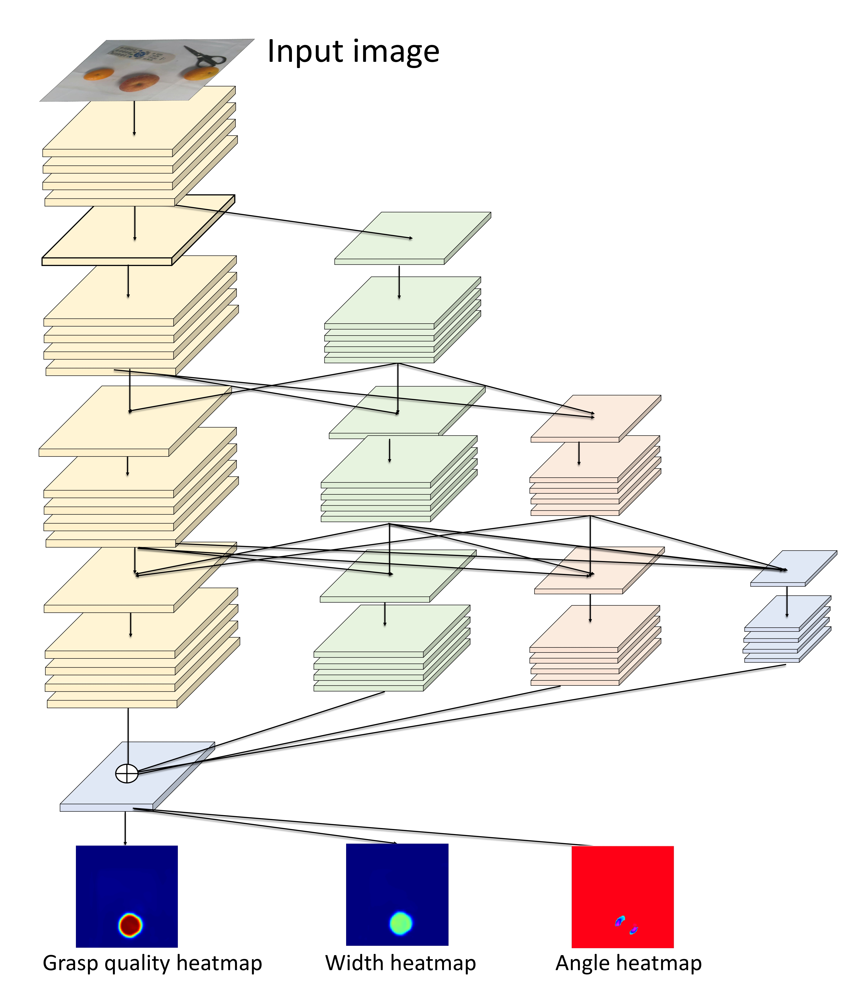
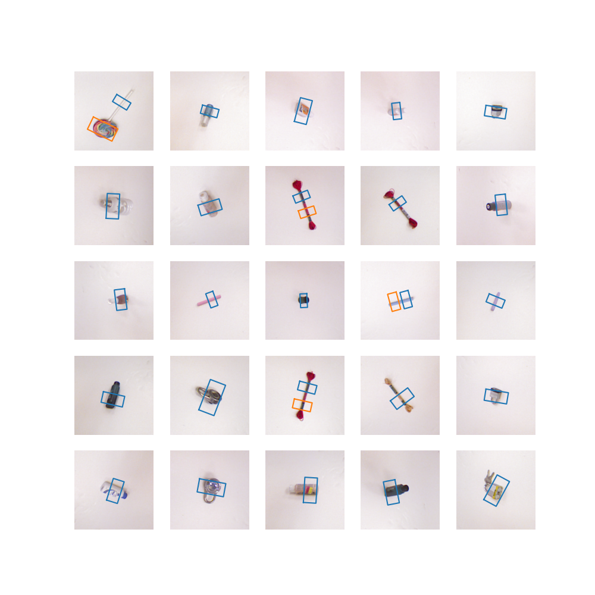
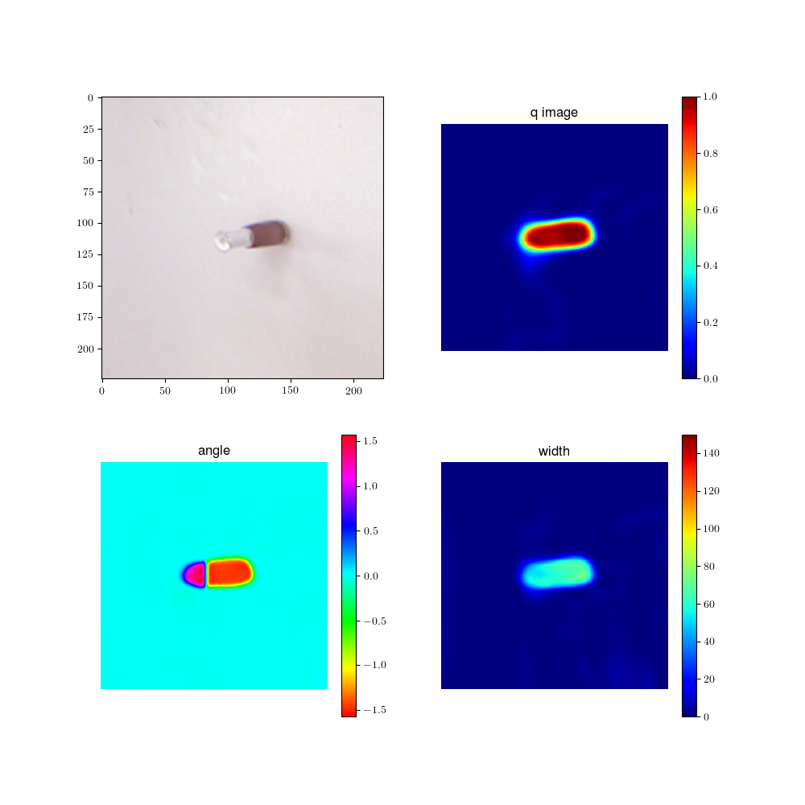
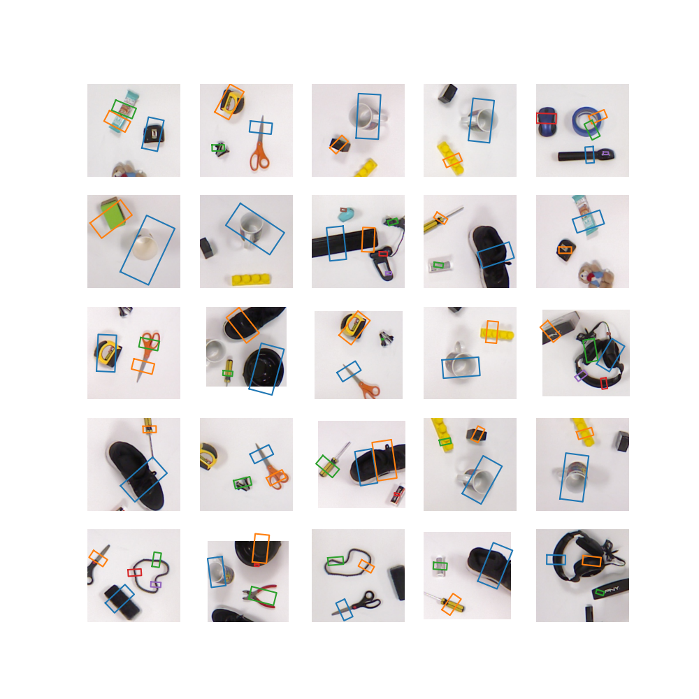

# HRG_Net
To reduce the spatial dimensional inaccuracy due to upsampling in the traditional CNN framework, we develop a novel grasping visual architecture referred to as High resolution grasp nerual network (HRG-Net), a parallel-branch structure that always maintains a high-resolution representation and repeatedly exchanges information across resolutions. 

This repository contains the implementation of the High Resolution Grasp Nerual Network(HRG-Net) from the paper:
**A Robotic Visual Grasping Design: Rethinking Convolution Neural Network with High-Resolutions**

[arxiv](https://arxiv.org/abs/2209.07459)|[video](https://www.youtube.com/watch?v=Jhlsp-xzHFY)

**Contact**

Any questions or comments contact [mail](zzl1215@mail.ustc.edu.cn).

If you use this work, please cite:

    @article{zhou2022robotic,
    title={A Robotic Visual Grasping Design: Rethinking Convolution Neural Network with High-Resolutions},
    author={Zhou, Zhangli and Wang, Shaochen and Chen, Ziyang and Cai, Mingyu and Kan, Zhen},
    journal={arXiv preprint arXiv:2209.07459},
     year={2022}
    }

### Installation

    conda create -n hrgnet python==3.8
    conda activate hrgnet
    pip install -r requirements.txt / conda env create -f environment.yaml

### Datasets
[Cornell](pr.cs.cornell.edu/grasping/rect_data/data.php) | [Jacquard](https://jacquard.liris.cnrs.fr/) | [multiobject](https://drive.google.com/file/d/1ImPDs2Wz3Nv52NWVLNqHj6K02RIi1eGk/view?usp=sharing)(Just for test)

### Training
    
    python train_hrgnet.py

### Evaluation/Visualisation
For validation and visualization purposes, we provide our [previously trained model](https://drive.google.com/drive/folders/1mzC3R2I4MQ2MOuffxkD2KwNu8G_ozBSZ?usp=share_link)

    python evaluation_grasp.py    # For Cornell and Jacquard dataset

    python evaluation_heatmap.py  # For Cornell and Jacquard dataset

    python multi_grasp_visualization.py # For multiobject dataset

### Acknowledgement

Code heavily inspired and modified from https://github.com/dougsm/ggcnn.
The code for the experiments related to the robot in the physical environment will be released later. For more of our recent work please follow [link](https://github.com/USTC-ICR?tab=repositories)
